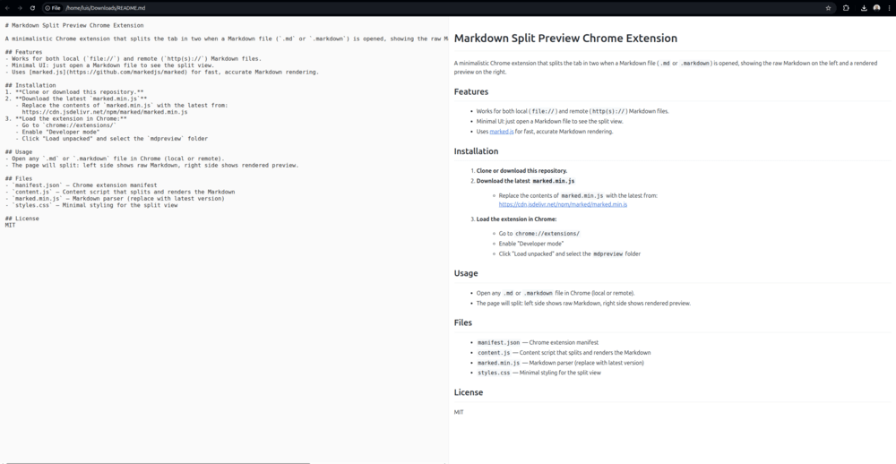

# Markdown Split Preview Chrome Extension

A minimalistic Chrome extension that automatically splits the browser tab in two when you open a Markdown file (`.md` or `.markdown`), displaying the raw Markdown on the left and a live, beautifully rendered preview on the right. Features VS Code-like styling, dark/light mode support, and synchronized scrolling for a seamless reading and editing experience.

## Features
- Works for both local (`file://`) and remote (`http(s)://`) Markdown files.
- Minimal UI: just open a Markdown file to see the split view.
- Uses [marked.js](https://github.com/markedjs/marked) for fast, accurate Markdown rendering.

## Installation
1. **Clone or download this repository.**
2. **Download the latest `marked.min.js`**
   - Replace the contents of `marked.min.js` with the latest from:  
     https://cdn.jsdelivr.net/npm/marked/marked.min.js
3. **Load the extension in Chrome:**
   - Go to `chrome://extensions/`
   - Enable "Developer mode"
   - Click "Load unpacked" and select the `mdpreview` folder

## Usage
- Open any `.md` or `.markdown` file in Chrome (local or remote).
- The page will split: left side shows raw Markdown, right side shows rendered preview.

## Files
- `manifest.json` — Chrome extension manifest
- `content.js` — Content script that splits and renders the Markdown
- `marked.min.js` — Markdown parser (replace with latest version)
- `styles.css` — Minimal styling for the split view

## License
MIT
